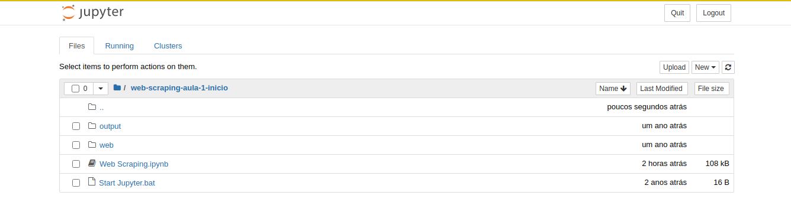

# Curso Alura Web Scraping Data Science Python

## Projeto feito durante o [Curso de Web Scraping Data Scrience](https://cursos.alura.com.br/course/web-scraping-data-science-python) para raspar todas as imagens de carros do [Alura Motors](https://alura-site-scraping.herokuapp.com/)


## Installation

1. You can find the installation documentation for the [Jupyter platform on ReadTheDocs.](https://jupyter.readthedocs.io/en/latest/install.html)

```
$ pip install notebook
```
2. You can find the installation documentation for the [Beautiful Soup](https://www.crummy.com/software/BeautifulSoup/bs4/doc/#installing-beautiful-soup)

```
$ pip install beautifulsoup4
```
3. You can find the installation documentation for the [Pandas](https://pandas.pydata.org/pandas-docs/stable/getting_started/index.html#getting-started)

```
$ pip install pandas
```


## Usage
```python
$ jupyter notebook
```


Find the file "Web Scraping.ipynb" 




